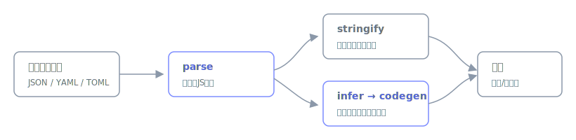

# datashape

[](https://github.com/miruky/datashape/actions/workflows/ci.yml)
[](https://www.typescriptlang.org/)
[](https://vitest.dev/)
[](https://opensource.org/licenses/MIT)

**JSON・YAML・TOML を相互変換し、データ構造からそのまま型定義を起こすブラウザツールです。**

## 概要

左に貼ったデータを、右で別の形式に変換します。入力形式は見た目から自動判定し、出力は JSON・YAML・TOML に加えて、構造を推論した TypeScript の interface と Go の struct を選べます。配列の要素やオブジェクトのキーの揺れはスキーマ推論の段階で畳み込み、片方にしか現れないキーは任意フィールドとして扱います。変換も型生成もブラウザ内で完結し、データを外部に送りません。

遊ぶ: https://miruky.github.io/datashape/

### なぜ作ったのか

設定ファイルの形式は JSON・YAML・TOML を行き来しがちで、そのたびに手で書き換えるのは退屈です。さらに、受け取った JSON に合わせて型を書く作業もよく発生します。変換と型起こしは別々のツールに分かれていることが多いので、同じデータから両方を一度に得られる場所が欲しくて作りました。

## 使い方

- 左に JSON・YAML・TOML のいずれかを貼ります(形式は自動判定、手動指定も可)
- 右の出力形式を選びます。`TypeScript 型` と `Go 構造体` は構造を推論して定義を生成します
- 結果はコピーボタンで取り出せます

TOML はトップレベルがオブジェクトである必要があるなど、形式固有の制約はエラーとして表示します。

## アーキテクチャ



入力はまず `parse` で共通の JavaScript の値に落とし、出力形式に応じて `stringify` で書き出すか、`infer` で構造(スキーマ)を推論して `codegen` が型定義を組み立てます。スキーマ推論・マージ・型生成はDOM非依存の純粋なロジックで、ブラウザなしでテストしています。ネストしたオブジェクトは命名を避けてインラインで展開するため、生成結果がそのまま読めます。

## 技術スタック

| カテゴリ | 技術 |
|:--|:--|
| 言語 | TypeScript 5(strict) |
| 変換 | js-yaml / smol-toml(YAML・TOML) |
| ビルド | Vite |
| テスト | Vitest(28テスト) |
| リンタ | ESLint + Prettier |
| CI / CD | GitHub Actions |
| 配信 | GitHub Pages |

## プロジェクト構成

- `src/convert.ts` — 3形式のパースと書き出し、形式の自動判定
- `src/schema.ts` — JS値からの構造推論とスキーマのマージ
- `src/codegen.ts` — スキーマから TypeScript / Go の型定義を生成
- `src/main.ts` — 変換とコード生成のUI
- `docs/architecture.svg` — アーキテクチャ図

## はじめ方

### 前提条件

- Node.js 20 以上

### セットアップ

```bash
git clone https://github.com/miruky/datashape.git
cd datashape
npm install
npm run dev
```

### テストの実行

```bash
npm test
```

### Lintの実行

```bash
npm run lint
```

### デプロイ

`main` ブランチへのプッシュで GitHub Actions がビルドし、GitHub Pages へ配信します。

## 設計方針

- **中間表現は素のJS値** — 3形式を共通の値に落とし、変換と型生成の両方をそこから行う
- **推論ロジックの分離** — スキーマ推論・マージ・コード生成をDOM非依存にし、テストで担保する
- **型はインライン展開** — ネストしたオブジェクトに名前を作らず展開し、命名衝突を避けて結果を読みやすくする
- **データを外に出さない** — 変換も型生成もブラウザ内で完結する

## 制約

YAML・TOMLのパースは js-yaml と smol-toml に依存します。型生成は構造の推論に基づくため、実際の意図(列挙やフォーマット制約)までは表現しません。Goの共用体相当(複数型が混在するフィールド)は `interface{}` になります。

## ライセンス

[MIT](LICENSE)
